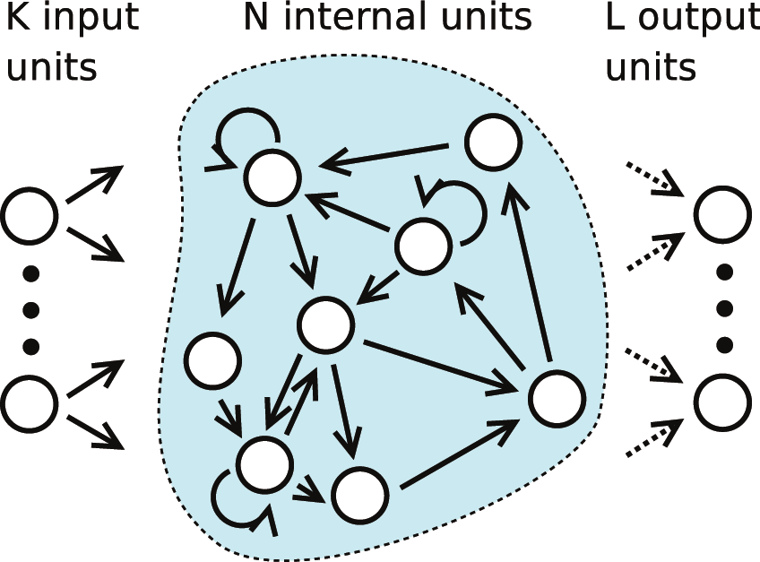

<p align="center">
  
</p>

# Echo State Network For Percussion music generation
The project aims to explore the use of Particle Swarm Optimization (PSO) to optimize the performance of Echo State Networks (ESNs) on music generation tasks. The project combines elements of computational optimization, machine learning, and music theory to create a system that can generate novel and coherent musical compositions. It focuses only on drum generation

## Documentation
The documentation can be found here [doc](https://vimmoos.github.io/Echo_State_Network/)

## Getting Started
1. Clone the repository: `git clone https://github.com/vimmoos/Echo_State_Network`
2. Create a new python (3.11<=) virtual env and install the dependencies: `pip install -r reqs.txt`
### Usage
The following is an example to train and then generate music
``` python
import project.test.music_test as tmusic
import numpy as np
import project.esn.core as c
import project.esn.transformer as ta
import project.parse_midi.post_proc as post_proc

train_len = test_len = 6200
init_len = 3200
music = (tmusic.test_patterns[2] * 300)
data = c.Data(np.array(list(~music)), music.tempo,
            init_len,train_len,test_len)
with c.Run(
    **
    {
        "data": data,
        "reservoir": 5000,
        "in_out": 9,
        "leaking_rate": 0.3,
        "reg": 1e-8,
        "transformer": ta.Transformers.pow_prob,
        "t_param": 1,
        "density": 0.04,
        "spectral_radius": 1.3,
        "t_squeeze": np.tanh,
        "noise" : 0
    }) as gen:
    result = gen()

# for this function to run you need to have install midicsv in linux to generate midi files from csv
post_proc.net2midi(result["output"],result["tempo"],"generated_music")
# alternatively you can use to generate a csv file that can be coverted to midi:
# post_proc.CSV_Out(result["output"],"generated_music")

```

For more example see `project/test/esn_t` where we show how to train the network with midi files.
